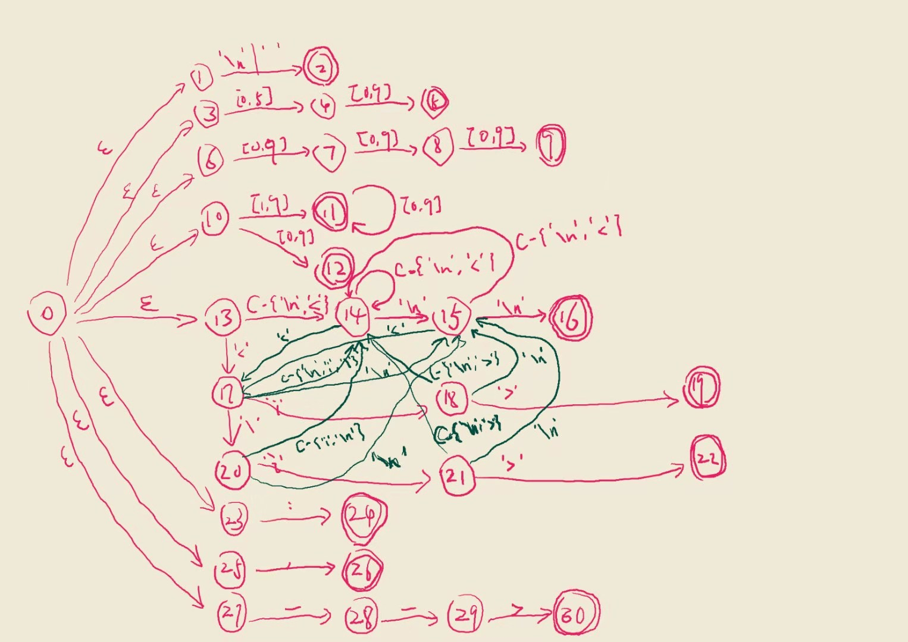
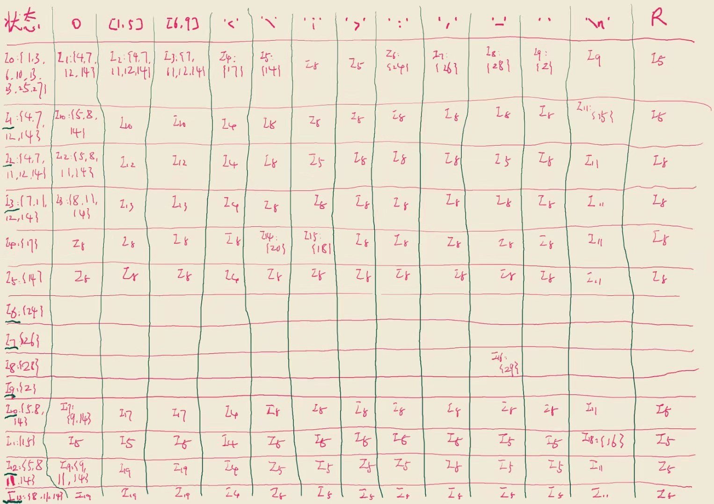

<h2><center>《编译原理》三级项目</center></h2>
**一、** ***\*项目名称\****

 

  srt字幕解释器。

 

**二、** ***\*字幕内容\****

 

  见文件subtitle.srt。

 

**三、** ***\*字幕解释器功能与设计问题说明\****


* 分析字幕的单词和语法，分别写出词法和语法的文法。

  * 词法：

    1. 基本字：

       * \<i>
       * \<\i>
       
    2. 标识符：
    
    3. 常数：
    
       * 00~59的宽度为2填充为0的两位数：
    
         F -> GD
    
         G -> 0|1|2|3|4|5
    
         D -> 0|1|2|3|4|5|6|7|8|9
    
       * 000~999的宽度为3填充为0的三位数：
    
         E -> DDD
    
         D -> 0|1|2|3|4|5|6|7|8|9
    
       * 整数
    
         I -> J|KI
    
         J -> JJ|0|1|2|3|4|5|6|7|8|9
    
         K -> 1|2|3|4|5|6|7|8|9
    
       * 字符串
    
         T -> H\nT|H
    
         H ->HH|!|"|'|,|-|.|/|0|1|2|3|4|5|6|7|8|9|:|<|>|?|A|B|C|D|E|F|G|H|I|J|K|L|M|N|O|P|Q|R|S|T|U|V|W|X|Y|Z| |a|b|c|d|e|f|g|h|i|j|k|l|m|n|o|p|q|r|s|t|u|v|w|x|y|z
    
     4. 运算符：
    
        * 时间连接符：:
        * 毫秒连接符：,
        * 时间延续符：-->
    
     5. 界符：{' ', '\n'} 
    
   * 语法：
      ​    S -> R | RS
      
      ​	R -> iBC	(i为整数)
      
      ​	B -> MpM	(p为-->)
      
      ​	M -> f:f:f,e	(f为00~59的宽度为2填充为0的两位数，e为000~999的宽度为3填充为0的三位数)
      
      ​	C -> CC
      
      ​	C -> t	(t为字符串)
      
      ​	C -> btd	(b为\<i>，d为\<\i>)
      
   * 语义（消除了上述语法的左递归）：
      ​	S -> RS	(S.list.push_back(R))
      
      ​	S -> epsilon
      
      ​	R -> iBC	(R.sid=i, R.begin=B.begin, R.end=B.end, R.content=C.content)
      
      ​	B -> MpM	(B.begin=M1.val, B.end=M2.val)
      
      ​	M -> f:f:f,e	(M.hour=f1.lexval, M.minute=f2.lexval, M.second=f3.lexval, M.msecond=e.lexval)
      
      ​	C -> tD	(T.text=t.lexval, T.ishighlight=false, C.content=T+D.content)
      
      ​	C -> btdD	(T.text=t.lexval, T.ishighlight=true, C.content=T+D.content)
      
      ​	D -> CD	(D.content=C.content+D1.content)
      
      ​	D -> epsilon


* 在文法的基础上设计词法分析器和语法分析器。

  词法分析器设计：（做的时候把\</i\>错看成\<\i>\了，所有'\\'应为'/'）

  * NFA

    

  * NFA的确定化
    
    
    
    
    
  * DFA

    

  * DFA的化简：觉得化简后实际上终结的状态还是不变的，尽管DFA中终结的状态看起来貌似减少了，但编程的时候，要判断的状态还是那么多。不知道是不是理解有误。

  * 代码：

    ```c++
    
    ```
  
  语法分析器：
  
  * 按消除左递归后的文法，用递归下降子程序的方式实现，同时完成相关的语义操作
  
  * 代码
  
    ```c++
    
    ```
    
    
  
* 建立内存数据结构，缓冲字幕

  ```c++
  class subttime{
      public:
      int hour, minute, second, msecond;
  };
  class content{
      public:
      string text;
      bool ishightlight;
  };
  class subt{
      public:
      int sid;
      subttime begin;
      subttime end;
      list<content> cons;
  };
  // 该链表用于缓冲字幕
  list<subt> subtlist;
  ```

* 实现字幕平移（例如，将字幕整体推迟2秒）等功能，更新字幕文件。

  将字幕内容进行语义解释，存入一个subt类型的链表或数组中，例如

  0 

  00:00:01,000 --> 00:00:25,000

  English subtitle by : Eduun

  假定对应的字幕节点名为sx，则sx.sid=0, sx.begin.hour=0, sx.begin.minute=0, 

  sx.begin.second=1, sx.begin.msecond=0, sx.end.hour=0, 

  sx.end.minute=0, sx.end.second=25 , sx.end.msecond=0,

  sx.content=”English subtitle by : Eduun”.

 

**四、** ***\*项目难点\****

 

* 字幕内容可以包含任意字符，如数字、冒号等。

* 字幕内容可以不止1行。

* 可进一步考虑检查字幕单词语义的合法性（例如，分钟数为两位，范围00—59等）

 

**五、** ***\*遇到的困难\****

 

​	对于四中提到的项目难点，我们在设计文法的时候充分考虑到了，理论上都是可以解决的。另外，注意到字幕内容中有\<i\>与\</i\>标签，我们在文法设计时还给予这对标签“文字高亮”的语义。在编程实现的过程中，发现，这个字幕的文法与常见的编程语言的文法之间存在一个巨大的差异，就是“该字幕文法中，词法分析出来的词的属性与该词的位置是有关的”，所以在编程的过程中，为了解决这个问题，引入了队列EXPS，语法分析器每次取词前都先把它此次取词的期望属性告知词法分析器，词法分析器再以此为指导，再DFA中取词。通过这个队列来把“词出现的位置”这个信息加入词法分析过程中。

​	由于字幕的文法中，要显示的文本并不像编程语言那样用单引号或双引号quote起来，并且其中还夹杂着\<i\>与\</i\>标签，所以我们设计的文法规定，显示文本的结束由两个连续的换行符（'\n''\n'）指示，所以字幕文本文件中最后需要保证有两个连续的换行符。

 

**六、** ***\*TODO\****

1. NFA中漏掉了28、29与14、15之间的转移 [done]
2. 这个代码只有new没有delete，内存管理just like a shit

2. 按照持续时间和显示文本及是否高亮在TERMINAL模拟字幕输出

3. 完善文法检测，加入更多细致的错误提醒

4. 实现字幕平移


**七、** ***\*思考\****

​	这个字幕的解析，把文本一行行读入，再把每一行按特定的字符分割，就可以很方便地就把所要的信息提取出来了。按编译原理的方法做，整个过程就变得很复杂。是这样大材小用才显得复杂，还是说一开始的文法就设计得不好？是否可以设计出一个文法，达到前述的直接按特殊字符分割的效果？另外，加入了EXPS队列，让整个解释器没有了其他编译器的那种灵活和自动，每次取词前都要人工规定好期望的词，而不能像其他编译器那样完全由词法分析器提供词及其属性。真的没有办法不用EXPS吗？